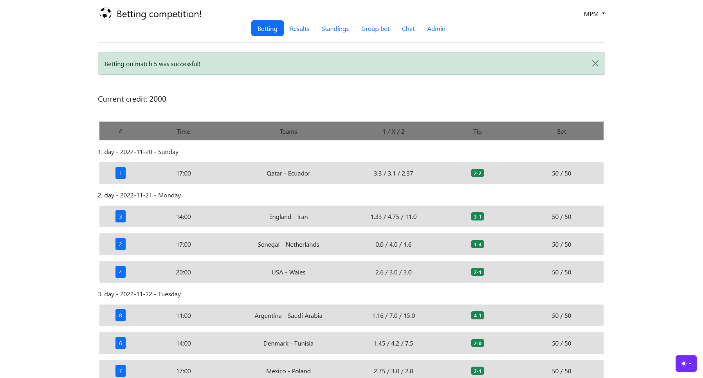
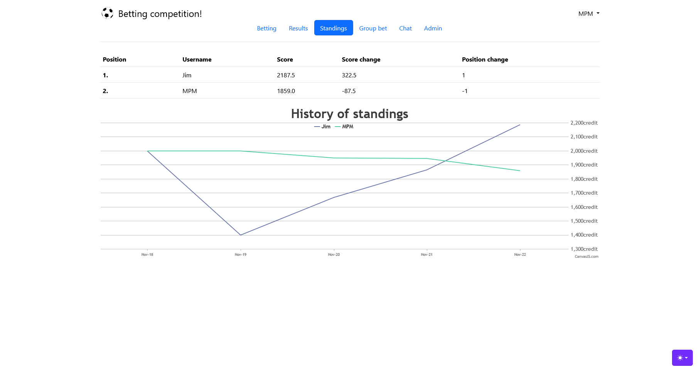

# Betting Competition Web Application

 

 

## Description

This hobby project's goal is to host a simple betting competition on the web among a group of friends for big football/sports tournaments.

Earlier this game was carried out manually sending emails and editing files on a cloud service. This application was developed to automate many of the cumbersome tasks for the admin and to provide a user-friendly interface for the players where they can publish their tips.

This application was developed with [Flask](https://flask.palletsprojects.com/en/2.1.x/) framework.

## Course/rules of the competition
The logic of the game is quite simple. The players starts with a given amount of credits.

The reward for a betting is always calculated as simple as  `multiplier * bet amount`, however the multiplier varies for different kind of bets.

Obviously, at the end the player with the highest amount of credits wins the competition.

### Group bet
Firstly the user has to specify the results of the group stage. The reward will be recevied logically after finishing the group stage. 

The winning multiplier for a specific group betting can be determined this way:

* 0× if zero or only one position was guessed right
* 2× if two positions were guessed right
* 4× if every position was guessed right

### Final result bet
Also at the start of the game the player may bet on a final result. 

The player can choose a team and bet that the team

* becomes champion
* reaches the final
* reaches the semi-finals
* or advances to the knock-out stage

For every possible betting there has to be an odd specified by the admin (namely 4×number of teams). The maximum value of betting credit is higher for this  than for the group betting or higher than the default value of match betting.

### Normal match betting
The core of the game is betting on the tournament matches. After the admin specifies the odds for the three possible outcomes (1, X, 2) for a match the users can bet on them.

The admin can change the maximum betting credit for each match. To raise the tensions of the game it is suggested to increase the maximum bet amount at the knockout stage progressively.

## Features

### Accounts
The players have to register an account to take part in the competition. The players have to specify the following parameters:
* `username`
* `email address`
* `password`
* preferences for email `reminders`.
* `invitation key`
* `language` of the site

There are two types of accounts `admin` and `generic user`. The `invitation key` determines the role of the player.

Currently there are two languages available: English and Hungarian.

### Betting
The homepage of the site lists the future matches (with their date and odds). Each of them can be edited until the start of the match.
No other player can see the user's bet until the match has started.

### Discussing
At the bottom of the homepage a simple chat plugin can be found which can be used to discuss the tournament with markdown formatting. It's quite primitive but using a dedicated commenting system would be an overkill for this project.

### Group and final result bet
At this section the player can set the group and final result bet.

### Previous bets
After a match has started the match is moved to the 'previous bets' section. Here the players can see every player's earlier bets, their results and their credit amount at the end of the match.

### Standings
This section shows the current standings of the players of competition and the visualization of the history of the game's standings. (One data point means the credit amount of a player at the end of the examined match day so the credit amounts are not visualized after each match only at the end of the days).

### Automatic updating + notifications
The users can ask for automatic reminders about matches to prevent missing out bets on them.

At the end of match days users can recieve the current standing of the game if they wish to.

The application automatically updates its result database after every match (but the update can be invoked manually too).

### Additional scopes for the admins
This section only appears for admins they have permission to do this additional tasks:

* set messages on the homepage
* send email message to every user
* modify the odds of the seperate mathces
* determine the group stages final result order (as it is not automated)
* determine if a user's final result bet was successful or not (as it is not automated)

## Hosting
The application (probably) can be hosted on any service which has Flask support.

This ReadMe presents you two techniques: [Heroku](https://heroku.com/) and self-hosting.

### Heroku

A [detailed guide](https://devcenter.heroku.com/articles/getting-started-with-python?singlepage=true) can be found here how to setup Heroku properly.

Summarizing the steps:
* Create a Heroku account and then create a project for it, then create an app inside the project
* Install [heroku-cli](https://devcenter.heroku.com/articles/heroku-cli), this tool acts as the command-line tool for the remote hosting server
* Checkout a new branch locally which will be pushed for Heroku and make this branch track the project branch and then push it to the Heroku remote
* Then scale the app to start it

If the repository is broken then it can be wiped with [heroku repo plugin](https://github.com/heroku/heroku-repo).

### Self-hosting
First clone your app to a place where the server has read/write permissions like the intended `/var/www/`,

To prevent package-collision problems it is suggested to create new a [conda](https://docs.conda.io/projects/conda/en/latest/index.html) environemnt. After cloning the project activate the new environment and install the dependencies:

    python -m pip install -r requirements.txt

After [setting up](#setting-up) you can run the application with Flask's server with the following command:

    python -m flask run

While Flask's own server is suitable for developing the application, later it becomes a bottleneck when the app goes live. The suggested solution is to use a web server. 

  
Self-hosting with Apache2

  
  This section guides you to set up the project it with [Apache2](https://httpd.apache.org/) through [mod_wsgi](https://modwsgi.readthedocs.io/en/master/) on Ubuntu.

  The first step is to install Apache2 and its developer tools.

    sudo apt install apache2 apache2-dev

The next step is to open the apache configuration file for your site (the default is /etc/apache2/sites-enabled/000-default.conf) then configure and add the following lines:

    WSGIDaemonProcess betting python-path=/path/to/miniconda3/envs/%env_name%/lib/python3.x/site-packages locale='C.UTF-8'
    WSGIScriptAlias / /path/to/BettingApp.wsgi
    WSGIProcessGroup betting
	WSGIApplicationGroup %{GLOBAL}

The next step is to install the mod_wsgi module for Apache2.

There are two possible solutions for this, one is to install it to the used conda environment:
  
    python -m pip install mod_wsgi
    
Which is then needeed to be installed to Apache's modules:

    mod_wsgi-express install-module

Copy and paste the LoadModule line to the config file.

The other solution is to install apache's own module:

    sudo apt-get install libapache2-mod-wsgi-py3

This method does not need further configuring. To enable or disable the module:

    sudo a2enmod/a2dismod mod_wsgi

After finishing the configuration restart apache2
    
    sudo systemctl restart apache2.service

Logs for the apache can be found her: `/var/log/apache2/`

You have to [create TLS certificate](https://www.digitalocean.com/community/tutorials/openssl-essentials-working-with-ssl-certificates-private-keys-and-csrs) (make sure it uses at least 2048-bit encryption) and [specify it to Apache](https://httpd.apache.org/docs/2.4/ssl/ssl_howto.html) if you want your connection to be secure.

Lastly the project configuration variables [have to be specifed](#setting-up).

## Setting up

### Fixture note

This project updates the result database with parsing fixtures from https://fixturedownload.com/. The app is set up to parse files which has this site's format.

If an other fixture format is needed to be parsed then the [database_manager.py](./app/database_manager.py) script have to be rewritten for it accordingly.

### Database

The project uses a PostgreSQL database.

Heroku provides [PostgreSQL support](https://devcenter.heroku.com/articles/heroku-postgresql) out of the box.

The linked guide also describes how to set up a database for your local machine.

<!--heroku pg:backups:schedule DATABASE_URL --at '02:00 America/Los_Angeles' --app sush-->

### Configuration variables
Before first launching the applicication the [project](./app/configuration.py) variables have to be specified. All of them has an explanation.

The default solution is to read them out from the environment variables this is solved differently for the various hosting options:

* for Heroku you have to specify the correct key-value pairs in the Config Vars section
* for the development Flask server specify them in the OSVARIABLES.sh bash script and execute it with `". OSVARIABLES.sh"`
* for Apache2 self-hosting method there is no elegant solution as you cannot pass environment variables to it so the easiest way to solve this is by editting the `configuration_container.py` script

After the configuration happened initialize the app with the following command:

    python -m flask init-db

### Team description files

The first registering admin is redirected to a page where two desciption csv files have to be uploaded.

One of them is a description about the teams, 

    teamname|groupid|top1|top2|top4|top16

The fields for this are the following:

* teamname: the key for a team it is the same as the key in the match fixtures
* groupid: the id of its group
* topX: odds for the final result bets

The other file contains the translations for the teams:

    teamname|en|hu|
    
The fields for this are the following:

* teamname: the same key as in the previous csv file
* the other columns hold the translations for the team names

### Email sending 

<!--The email sending is implemented with the Google API. First you have to create an account and a cloud project.-->

This section will be updated.

<!--To manually launch the automated reminders:

To immidiately send the standings (if it wasn't send due to some error):
    python -m flask standings-manual

To start scheduling (if app was rebooted midday)
* python -m flask checker-manual-->

<!-- GMAIL API Token key os.environ[] read at only startup or at retrieving?-->

### Translation

Currently only English and Hungarian languages are provided. To translate the app just simply copy one of the language folders from template and translate manually the html resource files. (Also check out the common subfolder in the templates folder!)

## Developer notes

I'm really bad at frontend so I used an existing template. The parts which I designed are quite ugly. Deriving from this mobile view is not supported.

The language system should be rewritten as the templating capabilites are not utilized properly, the whole html templates are copied instead of passing the proper translation strings into the templates.

## TO-DO
* New language system (flaskbabel?)
* New frontend + mobile view (+ delete unnecessary css + js files)
* Logging

* How to backup POSTGRES database
* Check if flaskscheduler works with Heroku
* Gmail API description + test + option to turn off emailing 

## License
The frontend part is based on the [Jinja Material Lite](https://github.com/app-generator/jinja-materialpro-lite) project which has [MIT license](https://github.com/app-generator/jinja-materialpro-lite/blob/master/LICENSE.md), my project meets these requirements.
My part is licensed as [GNU GENERAL PUBLIC LICENSE Version 3](LICENSE.md)
