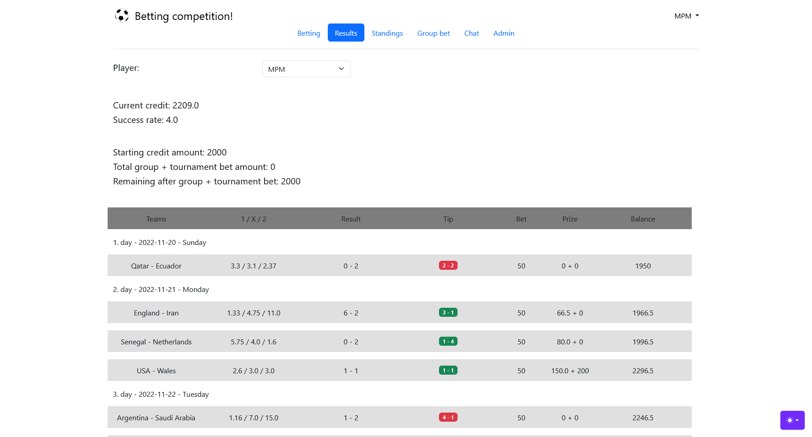
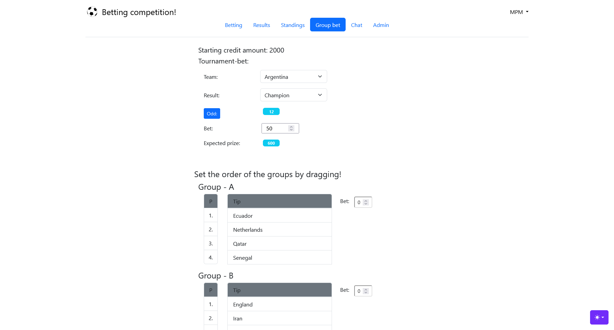
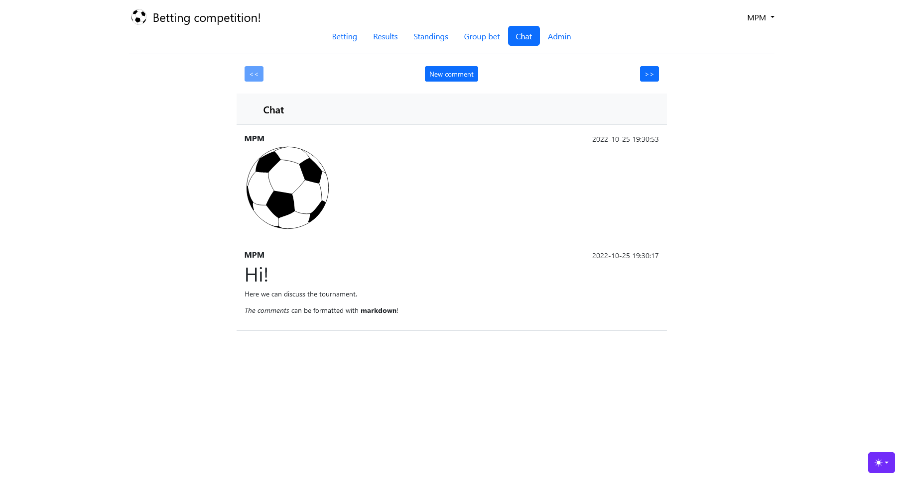

# Betting Competition Web Application

 

## Description

This hobby project's goal is to host a simple betting competition on the web among a group of friends for big football/sports tournaments.

Earlier this game was carried out manually sending emails and editing files on a cloud service. This application was developed to automate many of the cumbersome tasks for the admin and to provide a user-friendly interface for the players where they can publish their tips.

This application's backend was implemented with the [Flask](https://flask.palletsprojects.com/en/3.0.x/) framework while the frontend part was designed with [Bootstrap](https://getbootstrap.com/). The application can be hosted by building and running a [Docker](https://www.docker.com/) image.

## Demo

A statically served demo of the application can be checked out [here](https://mapema.hu/assets/betting-competition/index.html).

## Course/rules of the competition
The logic of the game is quite simple. The players starts with a given amount of credits.

The reward for a betting is always calculated as simple as  `multiplier * bet amount`, however the multiplier varies for different kind of bets.

Obviously, at the end the player with the highest amount of credits wins the competition.

### Group bet
First, the user has to specify the results of the group stage. The reward will be recevied logically after finishing the group stage. 

The winning multiplier for a specific group betting can be determined this way:

* 0× if zero positions were guessed right
* 1.5× if one position was guessed right
* 2.5× if two positions were guessed right
* 4× if every position was guessed right

These values can be modified in the [configuration](#configuration-file) file.

### Tournament result bet
Also at the start of the game the player may bet on a team's tournament result. 

The player can choose a team and bet that the team

* becomes champion
* reaches the final
* reaches the semi-finals
* reaches the quarter-finals

For every possible betting there has to be an odd specified by the admin (namely 4×number of teams). The maximum value of betting credit is higher for this  than for the group betting or higher than the default value of match betting.

### Normal match betting
The core of the game is betting on the tournament matches. After the admin specifies the odds for the three possible outcomes (1, X, 2) for a match the users can bet on them.

The admin can change the maximum betting credit for each match. To raise the tensions of the game it is suggested to increase the maximum bet amount at the knockout stage progressively.

## Features

### Accounts
The players have to register an account to take part in the competition. The players have to specify the following parameters:
* `username`
* `email address`
* `password`
* preferences for email `reminders`.
* `invitation key`
* `language` of the site

There are two types of accounts `admin` and `generic user`. The `invitation key` determines the role of the player.

### Betting
The homepage of the site lists the future matches (with their date and odds). Each of them can be edited until the start of the match.
No other player can see the user's bet until the match has started.

### Previous bets
After a match has started the match is moved to the 'previous bets' section. Here the players can see every player's earlier bets, their results and their credit amount at the end of the match.

### Standings
This section shows the current standings of the players of competition and the visualization of the history of the game's standings. (One data point means the credit amount of a player at the end of the examined match day so the credit amounts are not visualized after each match only at the end of the days).

### Group and tournament result bet
At this section the player can set the group and tournament result bet.

### Discussing
There is a built-in chat plugin which can be used to discuss the tournament with markdown formatting.

### Automatic updating + notifications
The users can ask for automatic reminders about matches to prevent missing out bets on them.

At the end of match days users can recieve the current standing of the game if they wish to.

The application automatically updates its result database after every match (but the update can be invoked manually too).

The users can get notified through the browser's [webpush](https://web.dev/articles/push-notifications-web-push-protocol) messages if they subscribe to notificiations on the home page.

### Additional scopes for the admins
This section only appears for admins they have permission to do this additional tasks:

* set messages on the homepage
* send email message to every user
* modify the odds of the seperate mathces
* determine the group stages final result order (as it is not automated)
* determine if a user's tournament result bet was successful or not (as it is not automated)

## Setting up

### Configuration file
Before launching the application the first time the correct values have to be specified in the [configuration file](./configuration.json).

Apart from the web-push keys, every field is self-explanatory.

To generate the webpush keys, install the following node js module and run the proper command:
    
    npm install web-push -g
    web-push generate-vapid-keys [--json]

### Launching the app

#### Development server 

Before starting the development you have to initialize the database with:

    python -m flask init-db

After, you can launch the development server.

    python -m flask run --debug

#### Hosting

The easiest way to host the application is using docker (either self-hosting or on a online service).

By launching the [install.sh](./install.sh) the script will ask you to properly configure the site and game parameters in the [configuration file](#configuration-file), after specifying them correctly the docker compose should set up the application.

The installer sets ups a `certbot` container which acquires the TLS certificate/key for the webserver (this requires an open 80 port), the needed parameters are acquired from the aforementioned `configuration.json` file.

Then the app/server container is built. The application is served with nginx + gunicorn, these require the 80 and 443 ports to be exposed to the web.

### Team description files

The first registering admin is redirected to a page where two desciption csv files have to be uploaded.

One of them is a description about the teams, 

    teamname|groupid|top1|top2|top4|top8

The fields for this are the following:

* teamname: the key for a team it is the same as the key in the match fixtures
* groupid: the id of its group
* topX: odds for the tournament result bets

The other file contains the translations for the teams:

    teamname|en|hu|
    
The fields for this are the following:

* teamname: the same key as in the previous csv file
* the other columns hold the translations for the team names

<!--
### Email sending 

The email sending is implemented with the [Google API](https://developers.google.com/gmail/api/quickstart/python). First you have to create an account and a cloud project.

The process of setting up email sending is specified in [this source](./app/gmail_handler.py) file-->

## Customizing the application

### Fixture

This project updates the result database with parsing fixtures from https://fixturedownload.com/. The app is set up to parse files which has this site's format.

If an other fixture format is needed to be parsed then the [database_manager.py](./app/database_manager.py) script have to be rewritten for it accordingly.

### Database

The app uses `SQLAlchemy` for database connection, which is a implementation-agnostic solution. However many specific tasks have to be solved differently with various SQL implementations. Therefore some raw queries only work with `SQLite` as it was chosen for the implementation as it is a very lightweight solution.

To use a different db, the `SQLite` specific parts have to be rewritten and specify the proper `SQLAlchemy` engine in the config file.

### Translation

Currently English and Hungarian versions are available. The translation is implemented with `Flask-Babel` so the site can be translated easily.

To setup babel translations these commands need to be launched:

    pybabel extract -F ./app/babel.cfg -o ./app/assets/translations/messages.pot .
    pybabel init -i ./app/assets/translations/messages.pot -d ./app/assets/translations -l `hu`

    pybabel update -i ./app/assets/translations/messages.pot -d ./app/assets/translations
    pybabel compile -d ./app/assets/translations

## TO-DO
* fix [group bonus calculation error](./app/results.py#L85) + restructure results
* clean-up statistics
* create SQL views

### Backlog
* check foreign key relations in DB
* trim whitespaces with jinja
* email notification/smtp?
* session handling with Flask-login
* Add timezone selector for user
* forcing redirect to group bet before start + redirect to team data upload at very first startup for admin
